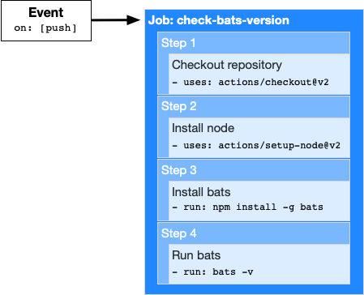

## Github-Actions 소개

### Github Actions란?

> Github Repository 기반으로 하는 개발 Workflow 자동화 툴, Github에서 제공하는 CI/CD 도구

[공식 Reference](https://docs.github.com/en/actions/learn-github-actions/introduction-to-github-actions#overview), [공식 Page](https://github.com/features/actions)

<br/>


* Github Actions는 이벤트 기반으로 명령이 실행된다.
* event가 발생하면, job이 포함된 workflow를 자동으로 triggers 한다.
* 그러면 해당 job은 steps를 이용해 actions가 실행되는 순서를 제어한다.

<br/>

<br/>

### Github-Actions의 Components

> Github Actions 실행을 위해 상호작용 하며 함께 작동하는 Components

<br/>


<br/>

#### Workflows

> 사실상 최상위 개념에 해당하는 자동화 될 작업들의 사이클

* repository에 추가하는 자동화된 절차
* 하나 이상의 jobs로 구성되며, events에 의해 예약 또는 실행(trigger)될 수 있음
* Github project를 build, test, package, release, deploy(배포) 하는데 사용할 수 있음

<br/>

#### Events

> 자동화 절차인 Workflow를 실행시킬 이벤트

* Workflow를 실행하는 특정 활동을 말함
* 예시 상황
  * commit을 repository에 push 하는 경우
  * 문제 발생 또는 pull request 생성되는 경우
  * 외부 이벤트 발생 시 repository dispatch webhook을 사용하는 경우
  * [그 외의 경우에 대한 전체 목록](https://docs.github.com/en/actions/reference/events-that-trigger-workflows)

<br/>

#### Jobs

> 동일한 러너에서 실행되는 하나의 단계로, Workflow를 구성하는 작업 단위

* 하나의 runner 에서 실행되는 일련의 단계
* 병렬 실행을 기본으로 하지만, 순차 실행 및 의존 관계로 구성 가능

<br/>

#### Steps

> Job을 구성하는 개별 작업 단위

* Job에서 명령(task)을 실행할 수 있는 개별 작업
* Action 또는 shell commeand 일 수 있음
* 동일한 runners에서 실행되므로 job 안의 action들이 서로 데이터 공유 가능

<br/>

#### Actions

> Steps를 구성하는 가장 작은 작업 단위

* Job을 생성하는 steps로 결합되는 독립된 실행 명령
* Workflow에서 가장 작은 작업 단위
* 재사용이 가능한 구성요소 (이식성)
* 고유한 작업을 만들거나 community에서 다른 사람이 만든 Actions를 가져다 사용 가능

<br/>

#### Runners

> Workflow가 수행되기 위한 가상 서버 인스턴스

* GitHub Actions runner application이 설치된 서버로, workflows가 가동되는 인스턴스
  * [Ubuntu Linux, MS Windows, macOS 기반](https://docs.github.com/en/actions/using-github-hosted-runners/about-github-hosted-runners)
* Github에서 제공하는 러너를 사용하거나 직접 호스팅해서 사용 가능
* Runner는 jobs의 실행 요청에 대한 수신을 항상 대기
* 한 번에 하나의 job을 실행하며, 진행 상황과 로그 및 결과를 github에 보고
* Workflow의 각 jobs는 새로운 가상 환경에서 실행
  * 타 운영체제 사용 희망시, [자체 러너 호스팅](https://docs.github.com/en/actions/hosting-your-own-runners) 가능

<br/>

<br/>

### Workflow 예제를 만들어보자

#### workflow 파일 정의하기

1. Repository에서 `.github/workflows/` 에 해당하는 디렉토리 경로를 생성한다.

2. 해당 디렉토리에 workflow 파일을 생성한다.

   * workflow 파일은 `.yml` 형식의 확장자를 가진다.

   * ex) `learn-github-actions.yml`

     ```yaml
     name: learn-github-actions
     on: [push]
     
     jobs:
       check-bats-version:
         runs-on: ubuntu-latest
         
         steps:
           - uses: actions/checkout@v2
           
           - uses: actions/setup-node@v2
             with:
               node-version: '14'
               
           - run: npm install -g bats
           - run: bats -v
     ```

3. 변경 사항을 add, commit 후 git repository에 push 한다.

<br/>

<br/>

#### workflow 파일 이해하기

> 위에서 정의한 `learn-github-actions.yml` 파일을 분석해보자.

<br/>

```yaml
name: learn-github-actions
```

* Github repository의 Actions 탭에 표시될 이름

<br/>

```yaml
on: [push]
```

* workflow 파일을 자동으로 실행시킬 event를 지정하는 구문
* 'Repository에 `push` 하면 이 workflow를 실행한다' 라는 조건을 의미
* `on` 키워드를 이용해 특정 분기, 경로, 태그에서만 실행되도록 설정 가능

<br/>

```yaml
jobs:
```

* 해당 workflow에서 실행되는 작업을 묶어 그룹화하는 키워드

<br/>

```yaml
  check-bats-version:
```

* 해당 job의 이름을 `check-bats-version` 으로 정의

<br/>

```yaml
    runs-on: ubuntu-latest
```

* workflow가 구동되는 환경의 OS를 Ubuntu Linux로  구성
* Github에서 호스팅하는 새로운 가상 머신에서 실행됨을 의미
* [다른 러너를 사용하는 구문 예제](https://docs.github.com/en/actions/reference/workflow-syntax-for-github-actions#jobsjob_idruns-on)

<br/>

```yaml
    steps:
```

* `check-bats-version` job에서 실행되는 모든 단계를 함께 그룹화
* 별도의 action 이나 shell command들을 하위 항목으로 가질 수 있음

<br/>

```yaml
      - uses: actions/checkout@v2
```

* `uses` 키워드는 어떤 action을 수행할지 지정하는 항목
* 위의 경우, 이미 만들어진 action을 검색해 수행함
  * repository를 체크아웃하고 runner에 다운로드하여 코드에 대한 작업을 실행할 수 있도록 하는 작업
    * 예) 테스트 도구
  * workflow가 code에 대해 실행되거나, repository에 정의된 작업을 사용할 때마다 체크아웃 작업이 필요

<br/>

```yaml
      - uses: actions/setup-node@v2
        with:
          node-version: '14'
```

* `actions/setup-node@v2` action으로 runner에 `node` 소프트웨어의 지정된 버전을 설치
* 그러면 `npm`를 사용 하여 명령에 액세스 가능

<br/>

```yaml
      - run: npm install -g bats
```

* `run` 키워드는 runner에서 수행할 명령어 작업을 의미
* 위 경우, npm을 사용하여 bats 소프트웨어 테스트 패키지를 설치

<br/>

```yaml
      - run: bats -v
```

* 마지막으로 `bats` 소프트웨어의 버전을 출력하는 명령어 작업을 수행

<br/>

#### workflow 파일의 시각화



<br/>

<br/>

#### workflow 활동 보기

1. Github repository 기본 page로 이동한다.

2. Actions를 클릭한다.

   * 아직 workflow_.yml 파일이 push 되지 않았다면

     다음과 같이 github action 시작 안내 화면이 뜬다.

   

3. 왼쪽 사이드바에서 보려는 Workflow를 클릭한다.

   

4. workflow run 에서 보고싶은 작업 이름을 클릭한다.

   

5. Jobs 아래에서 보고싶은 job 이름을 클릭한다.

   

6. 각 step의 결과를 볼 수 있다.

   

<br/>

<br/>

<br/>

## 작업 찾기 및 커스터마이징하기

* Actions는 workflow를 강화하고 구성하는 빌딩 블록이다.
* workflow는 이미 만들어져 있는 Actions를 커뮤니티에서 다운받아 포함하거나, 사용자가 직접 나만의 작업을 만들 수 있다.
* 작업을 검색하거나 사용하는 법 및 사용자 지정하는 방법에 대해 알아보자.

<br/>

### 개요

workflow에서 사용하는 작업은 다음에서 정의할 수 있다.

* 공개 Repository
* workflow 파일이 작업을 참조하는 동일한 repository
* Docker Hub에 게시된 Docker container 이미지


[이어서 공부할 곳](https://docs.github.com/en/actions/learn-github-actions/finding-and-customizing-actions)